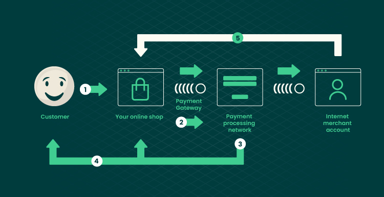
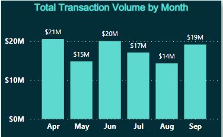
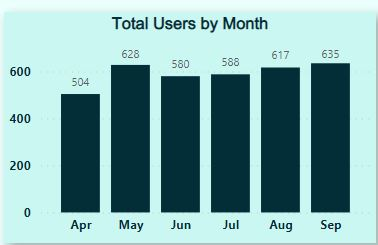
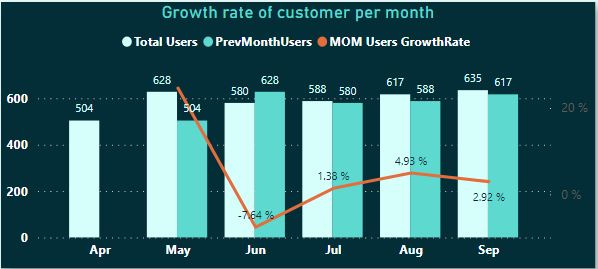
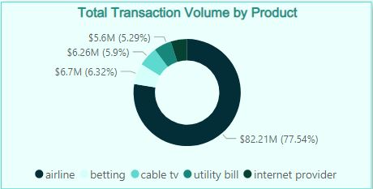
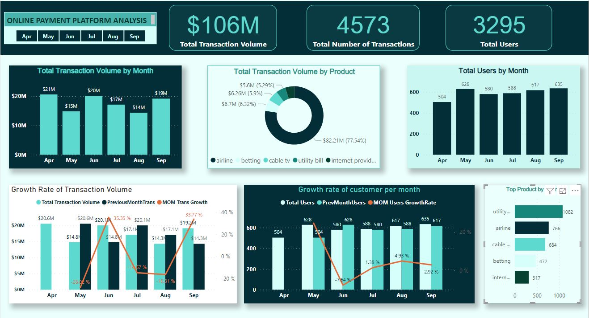
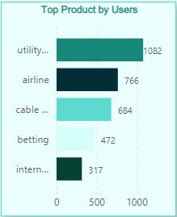
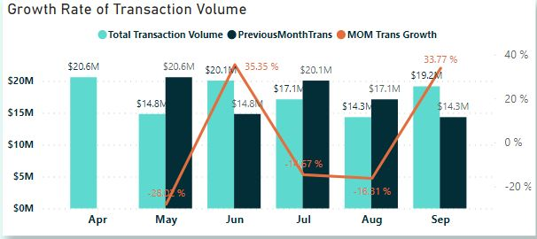
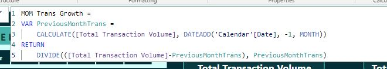

# ONLINE-PAYMENT-PLATFORM-ANALYSIS-WITH-POWERBI
This Analysis was done for a fintech company I worked for

_Name of company is withheld for certain privacy issues_ 

## Introduction

The fintech company has an online payment platform where consumer can pay bills, buy recharge,transfer money etc.
Some of the billers on the platform are internet service companies, cable TV, Airlines,
Schools, Utility providers (PHCN, Waterboards, etc), Betting companies, Retail Stores, Hotels and Travel etc. 
Here i did an analysis on the platform usage and below were the questions answered.

## Problem Statement
- Show the Total transaction volume for the six months and monthy
- Show the total users for the six months and monthly
- Show the Total transaction volume by products
- Show the top 5 products whose availability is critical to ensure sustained revenue.
- show the growth rate of transaction volumes per month.
- Show the growth rate of customer on the platform.

## Power BI Concepts applied:
DAX Concepts: Calculated column, Custom Column, Calendar Table created.
Data Modelling: Star Schema

## Data Sourcing
Data was given by the Company in excel format. I downloaded the csv file, and extracted it into Power BI for cleaning, analysis and visualization.
The data contains a sheet/table called Payment Table with 4593 rows and 7 columns
PEOPLE with 24 rows and 2 columns
RETURNS with 1079 rows and 3 columns

## Data Transformation/Cleaning:
Data was efficiently cleaned and transformed with the Power Query Editor of Power BI. [a screenshot of the applied steps] Some of the applied steps included
Making first row as headers in the PEOPle and RETURN tables.
Analytical transformation of the 'order table'; To have an idea of how long it takes on average for orders to be dilevered, [delivery days] need to be calculated. Using "custom columns", delivery days = [shipped date] - [order date]
created new column for year of order date and named: [Order Year]
ADDING conditional column to the 'Returns Table' to assign a numeric value to the Return response of YES and NO. If YES, then 1, else 0. Return Orders = IF(Returns[Returned] = "Yes", 1, 0)
Datatype then chnged from 'TEXT' TO 'WHOLE NUMBER'.

## DATA MODELLING
Power BI automatically connected related tables resulting in a star schema model. The 'Order' table is the fact table of the model. The remaining two dimension tables; 'Return' table and 'People' table are connected to the 'Order' table via the common columns: 'order ID' and Region respectively.

## Data Analysis and Visuals

From the dashboard, it is observed that it takes 4 days on average to deliver each product on every order.
Total sales made in 2012= 2.26M, 2013=2.68M ,2014=3.41M ,2015=4.30M.
Sales is highest in the Western Europe region with almost 450k dollars.
Tamara Chand is the most valuable costumer by sales.

## Conclusions & Recommendations
An order takes 4days on average before delivery.
There has been a gradual increase in the yearly sales since 2012 at the rate of approximately 19%.
Different customers topped the profit list for each year.
Tamara Chand has made the highest sales overall since 2012 to 2015. However, on a yearly basis, Sanjit Chand made the highest sale in 2012 with over 5.7k dollars while Tamara Chand could not make the top 10 sales for that year.
In 2013; Mike Gokenbach made the higest sales with 4.8k dollars.
In 2014; Tamara chand purchased products worth 8.5k.
In 2015; Raymond Buch purchsed products worth $7.4k.
Canon Image (Class 2200) advance copier made the highest profit in both 2014 and 2015. Other Insights:
The consumer segment has made more than 50% of the total sales.
Asia Pacific is the region with the highest sales.

[LINK TO POWERBI DASHBOARD](https://app.powerbi.com/view?r=eyJrIjoiYTIzNjY2YjMtZDg1NS00YzdhLWJmYzctNThiYTk2MzBkMTZkIiwidCI6IjY4ZDBlMjhiLTg3NTUtNDgzMi1iM2JjLWRhOGQwNjM3YzY5ZCJ9&pageName=ReportSection)

