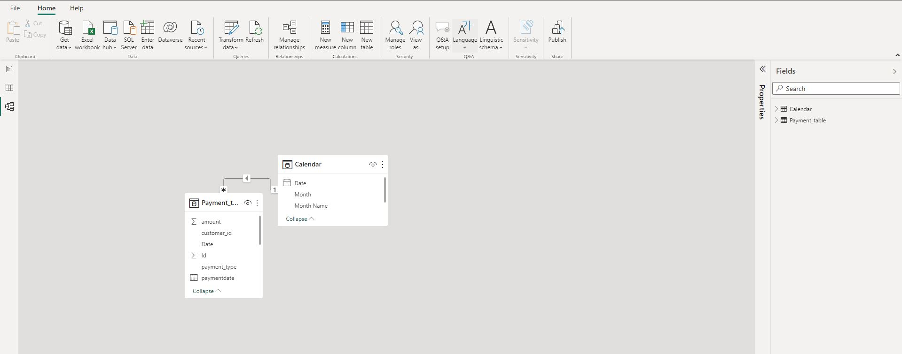

# ONLINE-PAYMENT-PLATFORM-ANALYSIS-WITH-POWERBI
This Analysis was done for a fintech company I worked for

_Name of company is withheld for certain privacy issues_ 

## Introduction

The fintech company has an online payment platform where consumer can pay bills, buy recharge,transfer money etc.
Some of the billers on the platform are internet service companies, cable TV, Airlines,
Schools, Utility providers (PHCN, Waterboards, etc), Betting companies, Retail Stores, Hotels and Travel etc. 
Here i did an analysis on the platform usage and below were the questions answered.

## Problem Statement
- Show the Total transaction volume for the six months and monthy
- Show the total users for the six months and monthly
- Show the Total transaction volume by products
- Show the top 5 products whose availability is critical to ensure sustained revenue.
- show the growth rate of transaction volumes per month.
- Show the growth rate of customer on the platform.

## Power BI Concepts applied:
DAX Concepts: Calculated column, Custom Column, Calendar Table created.
Data Modelling: Star Schema

## Data Sourcing
Data was given by the Company in excel format. I downloaded the csv file, and extracted it into Power BI for cleaning, analysis and visualization.
The data contains a sheet/table called Payment Table with 4573 rows and 6 columns

## Data Transformation/Cleaning:
I cleaned the data efficiently and did some transformations with the Power Query Editor of Power BI.

Some of the applied steps included
- Making first row as headers.
- Created new column for date from the payment date wich came with time and named: [Date]
- Datatype then chnged from 'TEXT' TO 'DATE'.

## Data Modelling
I created a calender table to allow me to slice and dice the data by date attributes such as weekday, month, quarter, and year if needed. 
Power BI automatically created a one-to-many relationship between the [Date] and [Payment] tables resulting in a star schema model. 

## Data Analysis and Visuals

From the dashboard, it is observed that;
1. Total transaction volume made in the six months from April to September = $106M,and April has the highest with $21M
2. Total number of transactions made in the six months from April to September = 4,573
3. Total number of Users = 3,295

## Conclusions & Recommendations
An order takes 4days on average before delivery.
There has been a gradual increase in the yearly sales since 2012 at the rate of approximately 19%.
Different customers topped the profit list for each year.
Tamara Chand has made the highest sales overall since 2012 to 2015. However, on a yearly basis, Sanjit Chand made the highest sale in 2012 with over 5.7k dollars while Tamara Chand could not make the top 10 sales for that year.
In 2013; Mike Gokenbach made the higest sales with 4.8k dollars.
In 2014; Tamara chand purchased products worth 8.5k.
In 2015; Raymond Buch purchsed products worth $7.4k.
Canon Image (Class 2200) advance copier made the highest profit in both 2014 and 2015. Other Insights:
The consumer segment has made more than 50% of the total sales.
Asia Pacific is the region with the highest sales.

[LINK TO POWERBI DASHBOARD](https://app.powerbi.com/view?r=eyJrIjoiYTIzNjY2YjMtZDg1NS00YzdhLWJmYzctNThiYTk2MzBkMTZkIiwidCI6IjY4ZDBlMjhiLTg3NTUtNDgzMi1iM2JjLWRhOGQwNjM3YzY5ZCJ9&pageName=ReportSection)

